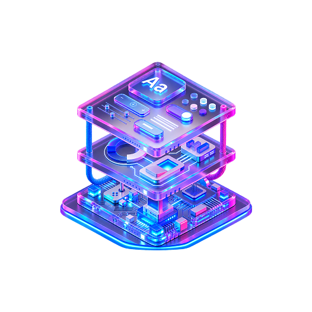

# 💻 DevStack

> **Explore technologies. Build your ideal developer stack.**

DevStack is a responsive web application that helps developers explore different technologies and create a personalized development stack.

Users can browse technologies by category, view their details, add technologies to their stack, and manage their selected technologies interactively.

## 🌐 Live Demo

**[Visit DevStack](https://devstack-assignment.netlify.app/)**

## 📸 Preview

<!-- Add a screenshot of the live project here -->



## 🛠️ Technologies Used

* **React** — Building reusable user interface components
* **TypeScript** — Type-safe development
* **Vite** — Development server and build tool
* **Tailwind CSS** — Utility-first styling
* **DaisyUI** — UI components
* **React Icons** — Interface icons
* **React Toastify** — Toast notifications
* **SweetAlert2** — Interactive alerts

## ✨ Key Features

### 🔍 Explore Technologies

Browse a collection of technologies across different categories, including:

* Frontend
* Backend
* Database
* Language
* Styling
* DevOps
* Tools

Each technology card provides information such as:

* Technology name
* Description
* Category
* Difficulty
* Rating
* Badge
* Technology icon

### 🧩 Build Your Stack

Users can add technologies to their personal development stack.

The selected stack updates dynamically as technologies are added or removed.

### 🚫 Duplicate Prevention

A technology cannot be added to the stack more than once.

Users receive a notification when they try to add a technology that has already been selected.

### 🗑️ Manage Your Stack

Users can:

* Remove individual technologies
* Remove all selected technologies
* View the number of selected technologies
* See an empty-state message when no technologies are selected

### 📱 Responsive Interface

The application is designed to provide a smooth experience across different screen sizes, including desktop, tablet, and mobile devices.

## 📂 Data Source

Technology information is stored locally in:

```text
public/data.json
```

The application loads this data and displays the technologies dynamically.

## 📦 Dependencies

### Main Dependencies

* `react`
* `react-dom`
* `react-icons`
* `@react-icons/all-files`
* `react-toastify`
* `sweetalert2`
* `tailwindcss`
* `@tailwindcss/vite`

### Development Dependencies

* `typescript`
* `vite`
* `@vitejs/plugin-react`
* `daisyui`
* `eslint`
* `eslint-plugin-react-hooks`
* `eslint-plugin-react-refresh`
* `@types/react`
* `@types/react-dom`

## 🚀 Run Locally

### 1. Clone the repository

```bash
git clone https://github.com/Sonia-Shurmi/devstack-assignment.git
```

### 2. Go to the project directory

```bash
cd devstack-assignment
```

### 3. Install dependencies

```bash
npm install
```

### 4. Start the development server

```bash
npm run dev
```

### 5. Open in your browser

```text
http://localhost:5173
```

## 📁 Project Structure

```text
src/
├── components/
│   ├── Footer/
│   ├── Hero/
│   ├── Navbar/
│   └── Technology/
│
├── assets/
├── types/
│
├── App.tsx
├── App.css
└── index.css

public/
└── data.json
```

## 🎯 Project Goal

DevStack was built to practice modern React development, component-based architecture, TypeScript, state management, responsive UI design, and interactive user experiences.

## 🔗 Links

* 🌐 **Live Demo:** https://devstack-assignment.netlify.app/
* 💻 **Repository:** https://github.com/Sonia-Shurmi/devstack-assignment

---

<p align="center">
  Built with ❤️ using React & TypeScript
</p>
